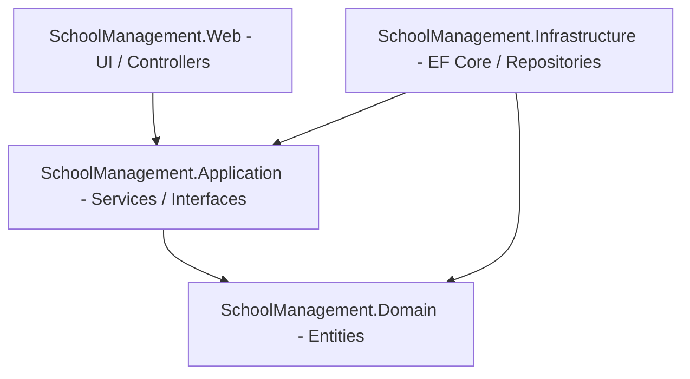

# School Management System (SMS) - System Architecture & Implementation

This document provides a comprehensive overview of the technical architecture and code implementation of the School Management System (SMS). It explains the structure of the application, how the data flows, and how the core features-including authentication, database operations via stored procedures, and the binary photo upload system with server-side validation-are implemented.

---

## 1. Technical Architecture (Clean Architecture)

The system is designed following the **Clean Architecture** guidelines, ensuring strict separation of concerns, high testability, and decoupling of domain logic from database and presentation frameworks.



### Core Projects & Layers

1. **`SchoolManagement.Domain`**
   * **Purpose**: Core enterprise models and validation entities. It does not depend on any other project or external framework.
   * **Key Components**:
     * C# representation of database tables (e.g., [SMS_StudentInfo.cs](file:///C:/SMS_Users/Steve/.gemini/antigravity/scratch/sms-mvc/src/SchoolManagement.Domain/Entities/SMS_StudentInfo.cs), `SMS_ClassMaster`, `SMS_DivisionMaster`, `SMS_FinancialYear`, `SMS_ClassSchedules`, `SMS_StudentMappings`).
     * View models mapping complex queries (e.g., [StudentDetailsView.cs](file:///C:/SMS_Users/Steve/.gemini/antigravity/scratch/sms-mvc/src/SchoolManagement.Domain/Entities/StudentDetailsView.cs) matching database view `vw_StudentDetails`).
     * Common generic return models (e.g., `DbOperationResult` and `DashboardData`).

2. **`SchoolManagement.Application`**
   * **Purpose**: Business rules orchestration, service layer declarations, and core application workflows.
   * **Key Components**:
     * Repository and service interfaces (e.g., `IStudentRepository`, `IStudentService`, `IAuthService`).
     * Password hashing algorithms (using PBKDF2 SHA-256 Identity V3) for secure authentication.

3. **`SchoolManagement.Infrastructure`**
   * **Purpose**: External integrations, database management, and EF Core mappings.
   * **Key Components**:
     * `SchoolDbContext`: Inherits from EF Core's `DbContext`. Maps stored procedures and views. Fluent API mappings handle properties like ignoring the unused `RecordId` on `DbOperationResult`.
     * Repositories (e.g., [StudentRepository.cs](file:///C:/SMS_Users/Steve/.gemini/antigravity/scratch/sms-mvc/src/SchoolManagement.Infrastructure/Repositories/StudentRepository.cs)): Leverages EF Core's `FromSqlRaw` to run database-stored procedures.

4. **`SchoolManagement.Web`**
   * **Purpose**: Presentation layer using ASP.NET Core MVC (Targeting .NET 7.0).
   * **Key Components**:
     * MVC Controllers (e.g., [StudentsController.cs](file:///C:/SMS_Users/Steve/.gemini/antigravity/scratch/sms-mvc/src/SchoolManagement.Web/Controllers/StudentsController.cs)): Handles web requests, mapping actions, and validating model binds.
     * Razor Views (`.cshtml` files): Generates dynamic HTML.
     * Configuration files (`appsettings.json`): Manages local connection string settings.
     * Startup setup (`Program.cs`): Hooks up cookie middleware and Dependency Injection containers.

---

## 2. Authentication & Authorization

The system implements cookie authentication and role-based access control.

* **Session Middleware**: Configured in `Program.cs` using `.AddCookie` default authentication schemes.
* **SMS_Roles**:
  * `Administrator`: Full system authorization. Can manage Financial Years, Divisions, Classes, Class Schedules, and Students.
  * `Clerk`: Data-entry restricted access. Authorized to edit/add students and manage class allocations. Restricted from accessing system configuration screens.
* **Security Mechanics**:
  * Passwords are encrypted using PBKDF2 with SHA-256 (10,000 iterations + Salt).
  * Controllers are decorated with `[Authorize]` or `[Authorize(SMS_Roles = "Administrator")]` attributes. Unauthorized users are dynamically redirected to `/Account/AccessDenied`.

---

## 3. Database Operations (SP-First & Views)

To leverage SQL Server's performance and transaction capabilities:
* **Mutations (Insert/Update/Delete)**: Routed through stored procedures (e.g., `usp_Student_Save`, `usp_Student_Delete`, `usp_FinancialYear_Save`). The procedures run inside transactions and write audit logs into `SMS_AuditLogs` automatically using SQL Server's native `FOR JSON PATH` mechanism.
* **Queries**: Structured as database views (e.g., `vw_StudentDetails`, `vw_ActiveClassSchedules`). Stored procedures select from these views (e.g., `usp_Student_GetAll`, `usp_Student_GetById`, `usp_Student_Search`) to retrieve full, denormalized records.

---

## 4. Student Photo Binary Management & Validation

Previously, student photos were saved as paths pointing to local disk folders. This was converted to a **strictly database-bound binary format (`VARBINARY(MAX)`)** stored in the database.

### The Problem
Allowing raw 5 MB+ image uploads directly into a database causes rapid database storage expansion, slows down reads/writes, and impacts memory utilization during Base64 rendering.

### The Solution: Server-Side Upload Validation
Student photo uploads are validated in `StudentsController` before storage. The controller allows only JPEG, PNG, and WebP content types, rejects empty files, and enforces a 2 MB maximum size.

#### Upload Pipeline:
1. The client uploads an image file via the `IFormFile studentPhoto` parameter in the `Create`/`Edit` post-actions.
2. The file is passed to `ValidatePhoto(IFormFile file)`.
3. Empty files, files larger than 2 MB, and unsupported content types are rejected.
4. Valid files are read asynchronously and stored in the database as `VARBINARY(MAX)`.
5. The output byte array is stored in the student model's `StudentPhoto` (`byte[]`) field and passed to `usp_Student_Save` as a `SqlParameter`.

```csharp
private static string? ValidatePhoto(IFormFile file)
{
    if (file.Length <= 0)
    {
        return "Student photo is empty.";
    }

    if (file.Length > MaxPhotoBytes)
    {
        return "Student photo must be 2 MB or smaller.";
    }

    return AllowedPhotoContentTypes.Contains(file.ContentType)
        ? null
        : "Only JPEG, PNG, or WebP photos are allowed.";
}
```

### View Rendering via Base64 Data URIs
Since the image is stored as binary `byte[]` in the database, the views render it directly without hitting any physical file path.
Inside the Razor templates (e.g. `Index.cshtml`, `Details.cshtml`, `Edit.cshtml`), the binary photo array is checked for null. If present, it is dynamically converted to a Base64 string and embedded inside the HTML image source tag:

```html
@if (Model.StudentPhoto != null && Model.StudentPhoto.Length > 0)
{
    var base64 = Convert.ToBase64String(Model.StudentPhoto);
    var imgSrc = String.Format("data:image/jpeg;base64,{0}", base64);
    
}
else
{
    
}
```

---

## 5. UI Design Theme

The web app interface is styled with a custom **Crimson Red & Deep Velvet Burgundy** theme:
* **Typography**: Outfit Google Font via custom styling rules in `site.css`.
* **Layout**: Flexible grid/flex layouts with premium glassmorphism card panels.
* **Micro-Animations**: Clean, responsive hover scales on side nav links and action buttons to keep the application feeling responsive and premium.

---

## 6. Phase 2 Features (Staff, Fee, and Payments Management)

Phase 2 introduces comprehensive support for administrative configurations (Staff, Semesters, Fees) and financial workflows (Payments).

### 6.1. Staff Management
*   **Domain Representation**: `SMS_StaffDetail` and `SMS_StaffTypeMaster`.
*   **Key Operations**: Add, Edit, Delete, and View staff members. Staff are assigned to class schedules to represent class teachers.

### 6.2. Fee Configurations
*   **Tables**: `SMS_FeeMaster` (stores base fee amounts), `SMS_SemesterMaster` (e.g., "Sem-1", "Sem-2"), and `SMS_FeeDetail` (maps fees and semesters to classes for a specific Financial Year).
*   **SP Integration**: `usp_Dropdown_GetAvailableFeesForClass` yields available class fees for selection during fee collection. It returns the full set of columns mapped to the C# `FeeDetailsView` entity.

### 6.3. Payments CRUD & Student Ledger
*   **Full CRUD Workflow**:
    *   **Index (All Payments)**: Accessible via the sidebar "Student Payments" link. Lists all payment receipts in the system with DataTables-powered filtering, sorting, and export capabilities (Excel, PDF, Print). Features a receipt photo modal preview.
    *   **Student Ledger**: Visualizes a student's entire fee transaction history and balances. Accessible via the student directory or details screen.
    *   **Payment Collection (Collect)**: Allows selecting a class-configured semester fee, choosing payment mode (Cash, UPI, Card, NetBanking, Cheque), adding a transaction reference, and uploading a receipt photo (which is stored as a Base64 string in `SMS_PaymentDetail`).
    *   **Delete**: Soft-deletes payment records using `usp_PaymentDetail_Delete` and logs the delete operation in `SMS_AuditLogs`.

### 6.4. Pending Fees Dashboard & Reporting Page
*   **Reorganized KPI Cards Grid**:
    *   Rebuilt the statistics block on the main dashboard to use a cohesive 4 + 4 layout.
    *   **Top Row**: Admitted Students, Mapped Students, Active Classes, Total Capacity.
    *   **Bottom Row**: Total Staff, Fees Collected, **Pending Fee Students** (clickable card), **Pending Fees (Amount)** (clickable card).
    *   Clicking either of the pending fees cards navigates directly to the outstanding report page.
*   **Outstanding Reporting Page (`/Payments/PendingReport`)**:
    *   Displays all students with remaining balances for the active financial year.
    *   Includes Class and Semester select filters.
    *   Lists the student details, assigned class teacher (`StaffName` resolved via stored procedure join), and fee totals (expected, paid, and remaining balance).
    *   Includes print styles that automatically exclude sidebar, navigation, filters, and action columns to generate clean print formats.
    *   Provides direct "Collect Fee" redirect triggers to collect payments for specific students.

---

## 7. Database Deployment Guide

To deploy or rebuild the database to a clean, error-free state, run the SQL scripts located in the `database/` and `scratch/` directories in the following order:

### 7.1. Database Setup Sequence
1.  **[01_create_database.sql](file:///C:/SMS_Users/Steve/.gemini/antigravity/scratch/sms-mvc/database/01_create_database.sql)**: Drops the existing `SMS` database if present and initializes a clean one.
2.  **[02_create_tables.sql](file:///C:/SMS_Users/Steve/.gemini/antigravity/scratch/sms-mvc/database/02_create_tables.sql)**: Sets up tables for Financial Years, Class/Divisions, Students, Staff, Fees, and Payments.
3.  **[03_create_constraints.sql](file:///C:/SMS_Users/Steve/.gemini/antigravity/scratch/sms-mvc/database/03_create_constraints.sql)**: Adds foreign keys and check constraints.
4.  **[04_create_indexes.sql](file:///C:/SMS_Users/Steve/.gemini/antigravity/scratch/sms-mvc/database/04_create_indexes.sql)**: Implements filtered unique indexes.
5.  **[05_seed_data.sql](file:///C:/SMS_Users/Steve/.gemini/antigravity/scratch/sms-mvc/database/05_seed_data.sql)**: Seeds default users, academic configurations, staff, classes, divisions, and demo students.
6.  **[06_functions.sql](file:///C:/SMS_Users/Steve/.gemini/antigravity/scratch/sms-mvc/database/06_functions.sql)**: Declares utility functions.
7.  **[07_views.sql](file:///C:/SMS_Users/Steve/.gemini/antigravity/scratch/sms-mvc/database/07_views.sql)**: Creates base reporting views.
8.  **[08_create_stored_procedures.sql](file:///C:/SMS_Users/Steve/.gemini/antigravity/scratch/sms-mvc/database/08_create_stored_procedures.sql)**: Sets up core stored procedures.
9.  **[09_staff_and_fees_procedures.sql](file:///C:/SMS_Users/Steve/.gemini/antigravity/scratch/sms-mvc/database/09_staff_and_fees_procedures.sql)**: Registers staff, fee schedules, and payment stored procedures.
10. **[alter_photo_to_binary.sql](file:///C:/SMS_Users/Steve/.gemini/antigravity/scratch/sms-mvc/scratch/alter_photo_to_binary.sql)**: Alters the photo column to binary, updates student views/procedures, and modifies `usp_Student_Save` to allow manual user-provided GR Numbers with duplicate validation.

### 7.2. Alternate: Fast Patch Script
If the base database is already seeded, you can deploy the newest Phase 2 features directly using:
*   **[deploy_payment_fixes.sql](file:///C:/SMS_Users/Steve/.gemini/antigravity/scratch/sms-mvc/scratch/deploy_payment_fixes.sql)**: Deploys SPs for the Payments Index, soft delete operations, and dropdown list fixes.
*   **[alter_photo_to_binary.sql](file:///C:/SMS_Users/Steve/.gemini/antigravity/scratch/sms-mvc/scratch/alter_photo_to_binary.sql)**: Integrates manual GR entry rules and binary photo processing.


